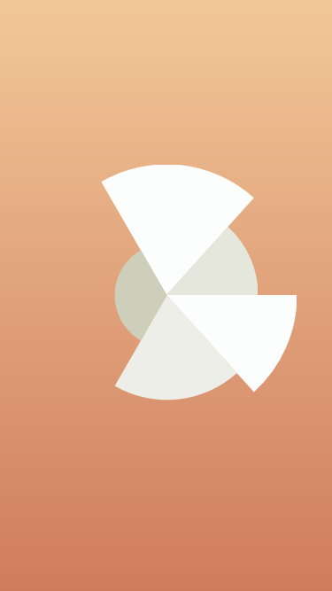

# Pie Chart

This example shows how you can create simple, but good looking graphs using the premium Fuse.Charting library. In this example, we will create a nice pie-chart using the `PlotWedge` component of the `Fuse.Charting` library.

## Preparation

In order to use the library, you have to include `Fuse.Charting` package in your unoproj file:

```
"Packages": [
    "Fuse.Charting"
  ],
```

## Drawing the slices

Slices are drawn using `PlotWedge`, like so:

	<c:PlotData >
		<c:PlotWedge Width="{Plot data.object}.sizePercent" Height="{Plot data.object}.sizePercent" Color="(((1 - {{Plot data.object}.size/100}) * #b0b08C) + (({{Plot data.object}.size/100}) * #FCFEFE))" HitTestMode="LocalVisual" />
	</c:PlotData>

The size of the wedges are calculated in js and fed through to the `PlotWedge` as `sizePercent`. Additionally, the size is used in an UX expression to calculate the color of the wedge.

